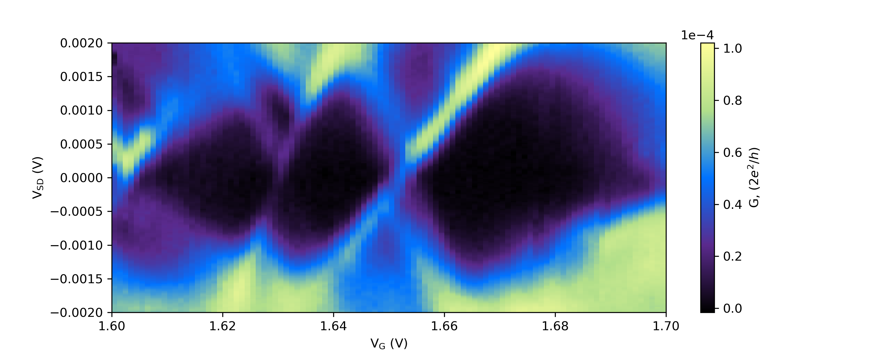
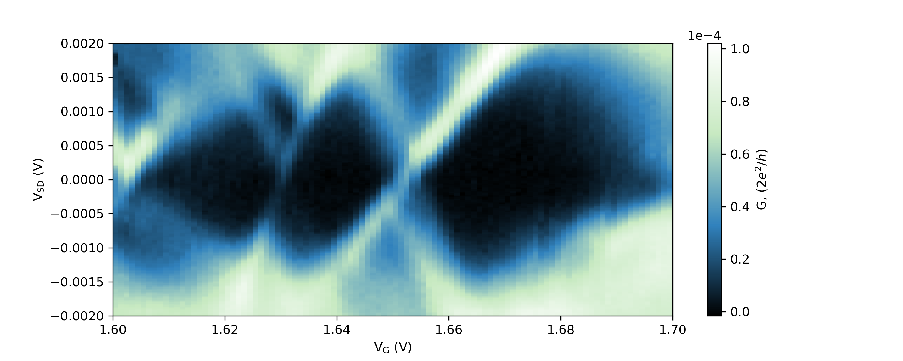
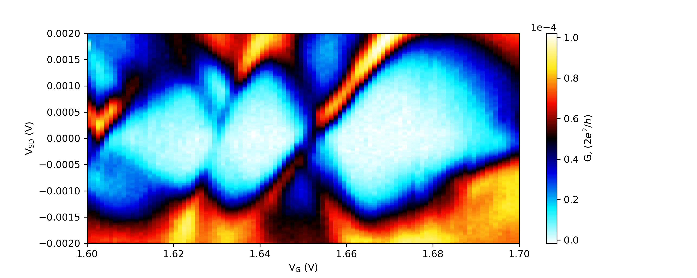
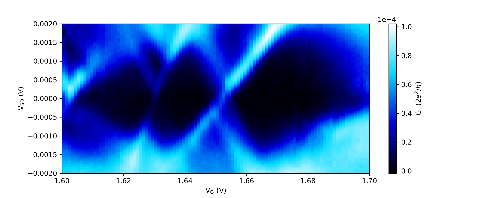
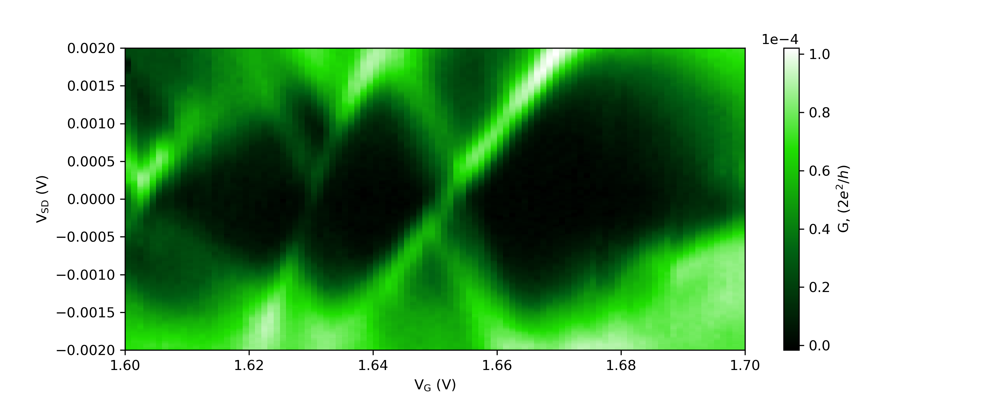
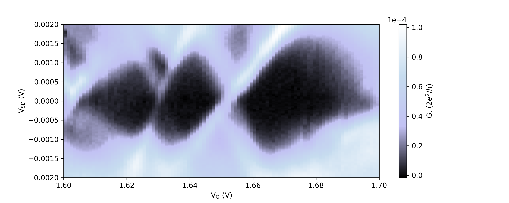

# eminusmap
Colormaps for matplotlib. Made with electron transport measurements in mind.

## Colormap examples
All colormaps also have the reverse version avaialble in the format \[name]\_r

### Lightning

### Ghost

### Icefire

### Frigid

### Poison

### Wraith
Needs updating. Not a good gradient.

